# Introduction

This project details the design and deployment of a fault-tolerant storage system.

## Performance Metrics

| Node ID | Sync Latency | Heartbeat | Status |
| :---: | :---: | :---: | :---: |
| **Node-01** | 4.2 ms | 1s | Active |
| **Node-02** | 3.8 ms | 1s | Active |
| **Node-03** | 8.1 ms | 2s | Degraded |

: Cluster Node Synchronization {#tbl:nodes}

\begin{equation}\label{eq:consensus}
Q = \left\lfloor \frac{N}{2} \right\rfloor + 1
\end{equation}

DRC Clean Layout's:

Inverter X1 Layout

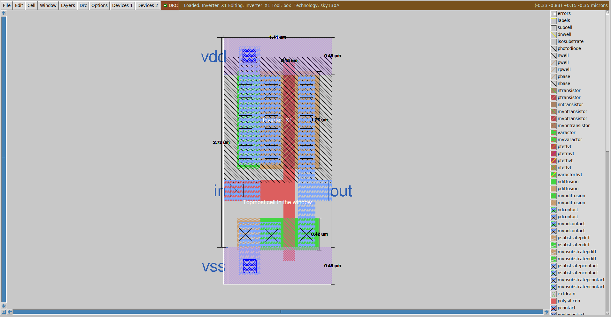

Inverter X2 Layout

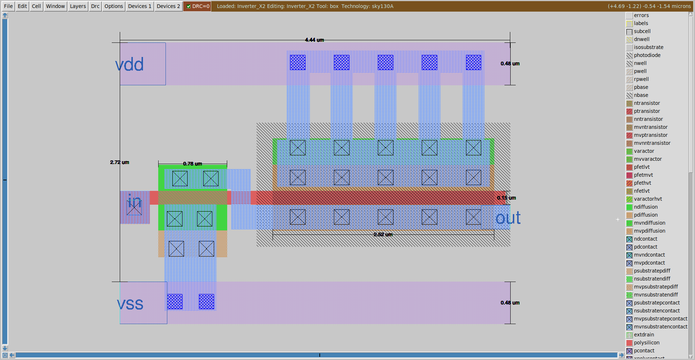

Transmission Gate Layout

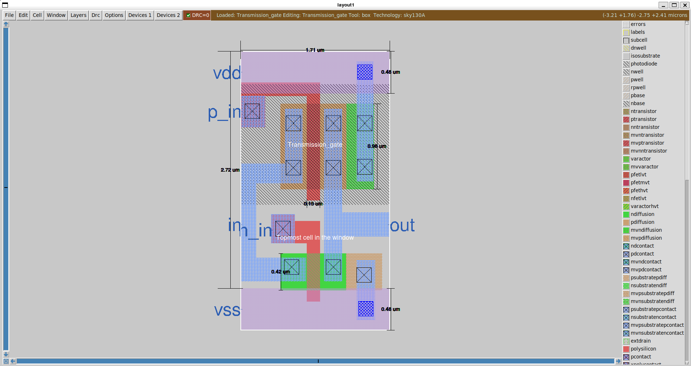

Masked Latch Layout

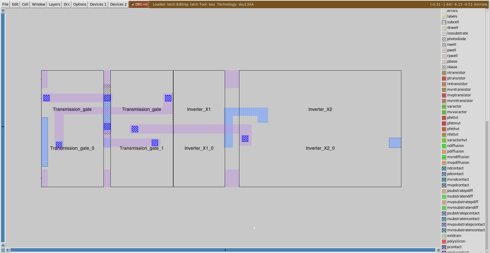

Latch Layout

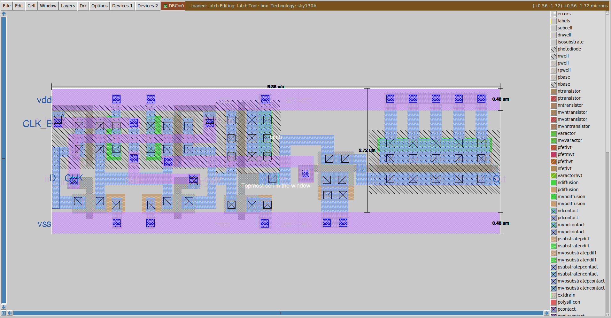

Masked Negative Edge triggered D Flip Flop Layout

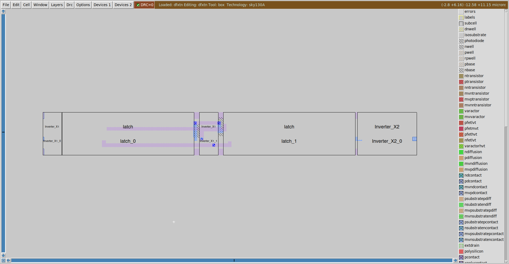

Negative Edge triggered D Flip Flop Layout

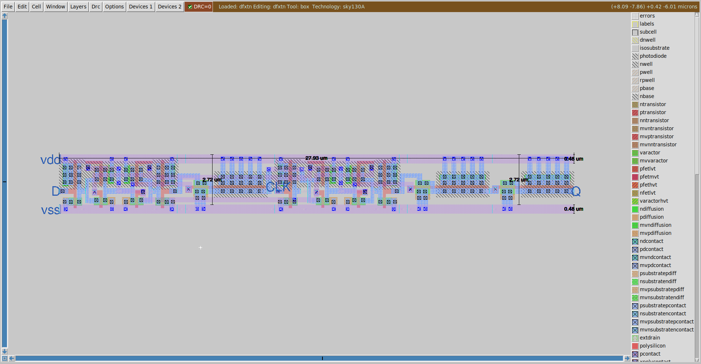

Inverter X1_25 Layout

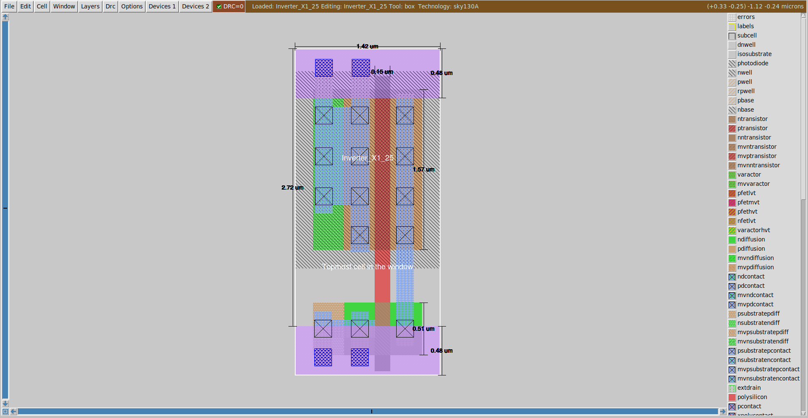

NAND MOSFETs' Layout

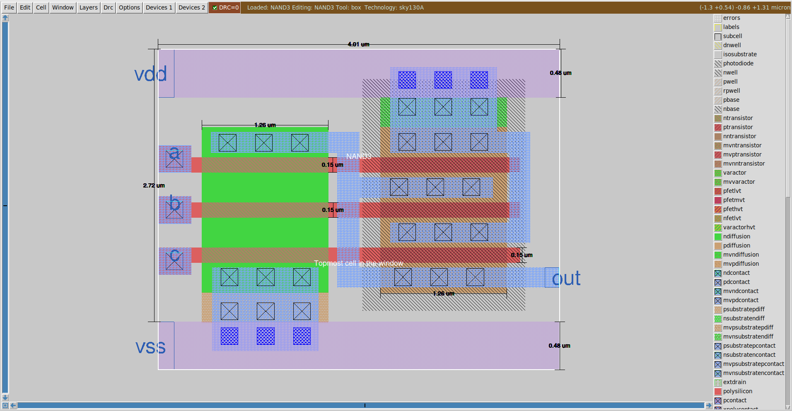

NAND3b Masked Layout

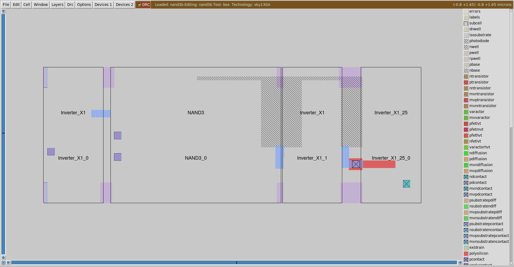

NAND3b Layout

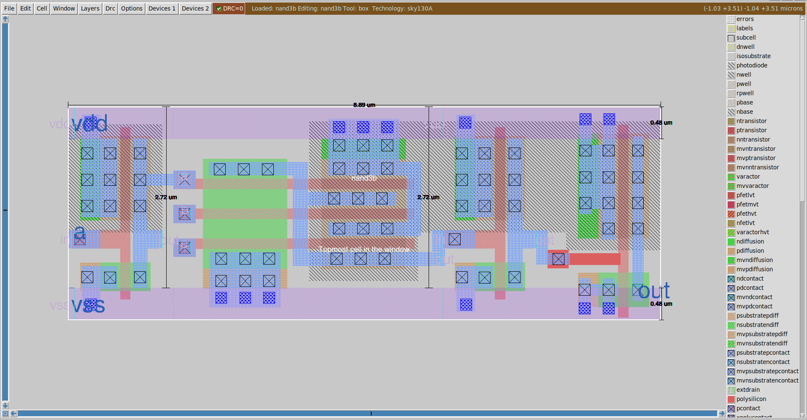

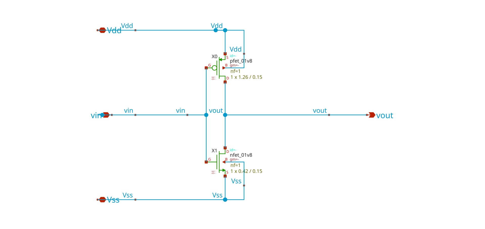
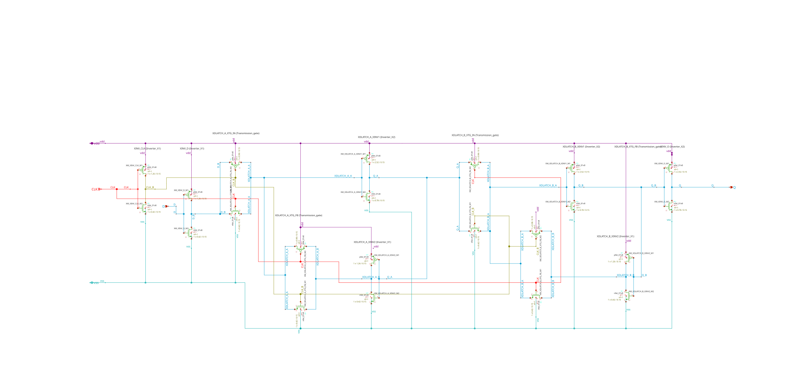
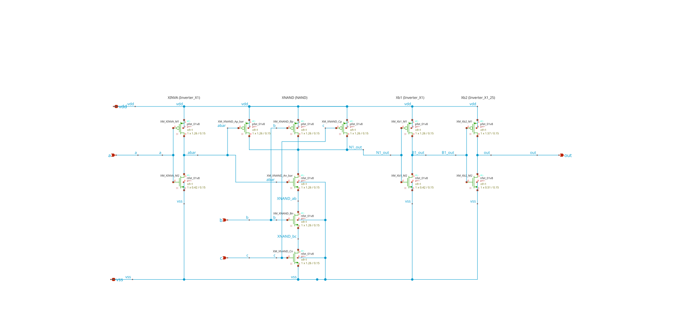

### Some of the Observation

While working with the dfliflop and nand3 spice simulation. I tried to equalise rise time and falltime same as of inverter as requirement of project. This excerise I have succesfully done in the dflipflop by converting all inverter to near X2. Because it's critical path for Dflipflop and higer strength invert will support the dflipflop to minimise the rise time and fall time. 

This excersise I can't able to do with NAND3. Since it have 3 different input and NMOS is in series. I tried to equalise or mimise rise time and falltime of all the path with respect to worst case delay. unfortunetly my width is constantly incresing to do so. and at some movemnt, making twiced the width gives less improvment in the time due to increase capacitance of cg and cd.

That's why I think to drive it with buffer. By doing so, I can able to achieve theoritical width of nmos and pmos of nand3. And also, able to achive similar risetime and falltime in very less mos width of NAND3. This migth increase some power and the propogation delay. but yes, I succesfully satify requirement of project.
